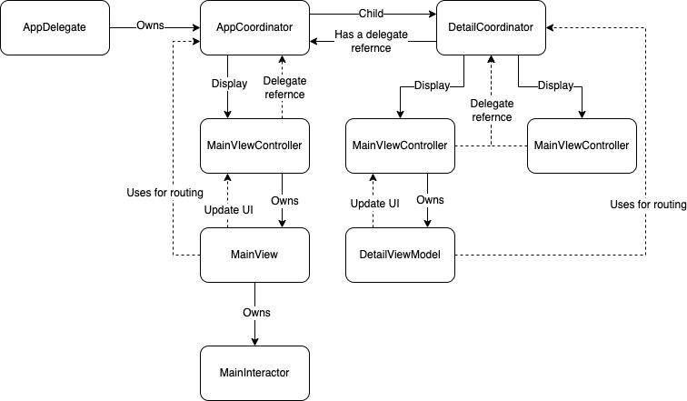

###使用架構
App 使用 MVVC-C 架構

###App架構圖如下:

###使用框架：
Alamofire 
Kingfisher 
Combine 

###程式說明
	API:
		Request:
			AssertsRequest.swift -> API Request 的參數
		Response:
			AssetsResponse.swift -> API 的資料
		MainInteractorProtocol.swift　-> 定義呼叫收藏列表頁需要呼叫 API 的函式協議
		MainInteractor.swift -> 實作 MainInteractorProtocol 並使用 Alamofire 呼叫 API
	Coordinator:
		Coordinator.swift -> 定義 Coordinator 協議
		AppCoordinator.swift -> App 的進入點, 並實作進入 main 面的方法
		DetailCoordinator.swift -> 實作進入收藏詳細頁的方法
	ViewController:
		MainViewController.swift -> 收藏列表頁
		DetailViewController.swift -> 收藏詳細頁 
		WebViewController.swift -> Permalink WebView
	ViewModels:
		MainViewModel.swfit -> 收藏列表頁 ViewModel, 透過注入的方式把 MainInteractor注入
		DetailViewModel.swift -> 收藏詳細頁 ViewModel, 點擊列時後把資料帶入
	Views:
		MainCollectionView.swift -> 收藏列表頁 Cell
		DetailCollectionView.swift -> 收藏詳細頁 Cell

###程式測試
Unit test 的函蓋範圍： 
Coordinator 
Interactor 
ViewModels 